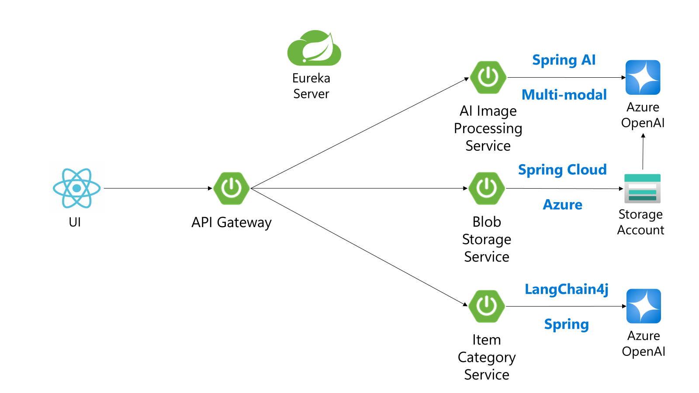
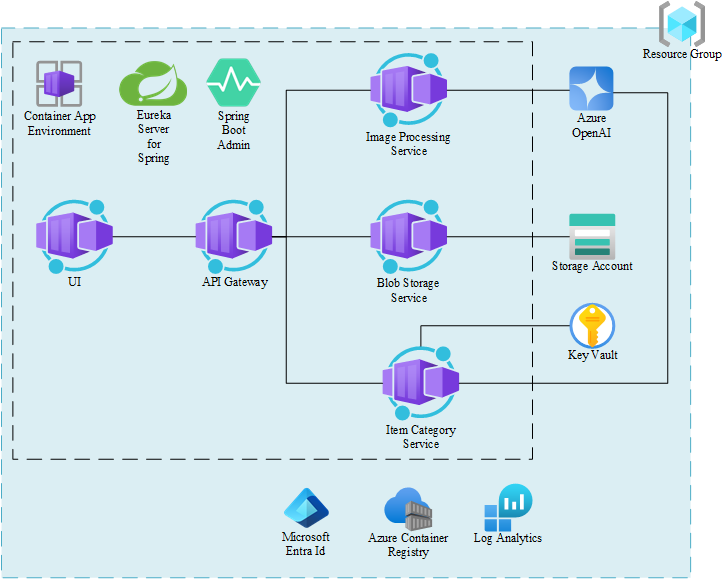

# Java AI - AI Shop

This is a simple AI Shop application that demonstrates how to use Azure OpenAI with Java to create a sample second hand shop. It uses the multi-modal capabilities of the OpenAI API to generate a description of the product based on an image. Instead of filling out a form, the users can simply upload an image of the product they want to sell and the AI will generate all the necessary information and fill the form for them.

The functional architecture of the application is as follows:
- `src/ai-shop-ui`: The user interface of the application. It is a simple React application that allows the user to upload an image and see the generated information in a form.
- `src/api-gateway`: The API Gateway of the application. It is a Spring Boot application that orchestrates the calls to the other services. It uses Spring Cloud Eureka Server for service discovery.
- `src/eureka-server`: The Eureka Server of the application. It is simple Eureka Server that is only required for local development.
- `src/ai-image-processing-service`: The AI Image Processing Service of the application. It is a Spring Boot application that uses `Spring AI` to generate the product information based on the image.
- `src/blob-storage-service`: The Blob Storage Service of the application. It is a Spring Boot application that uses `Spring Cloud Azure` to store the images in Azure Blob Storage. It also provide the generation of the image URL with a SAS token for the `ai-image-processing-service`.
- `src/item-category-service`: The Item Category Service of the application. It is a Spring Boot application that provides the categories of the items that can be sold in the shop. It uses `Spring Data JPA` to store the categories in a `H2` database. It is infused with AI and uses `LangChain4j` to generate the categories based on the product description.
- `src/java-ai-common`: A common module that is used by all the services. It contains the common DTOs.



## Prerequisites

Easiest way to start is to [deploy a GitHub Codespace](https://github.com/codespaces/new/Azure-Samples/java-ai) as it contains all the prerequisites.

If you deploy locally, you need to have the following installed:
- [Java 17+](https://learn.microsoft.com/en-us/java/openjdk/download)
- [Azure CLI](https://docs.microsoft.com/en-us/cli/azure/install-azure-cli)
- [Docker](https://docs.docker.com/get-docker/) or [Podman](https://podman.io/getting-started/installation)

## Run locally

To run the AI Shop locally, you need first to build the common module and then start the services. Follow the instructions below in the order they are presented:

1. [Build the common module](src/java-ai-common/common/README.md)
2. [Start the Eureka Server](src/eureka-server/README.md)
3. [Start the Blob Storage Service](src/blob-storage-service/README.md)
4. [Start the AI Image Processing Service](src/ai-image-processing-service/README.md)
5. [Start the Item Category Service](src/item-category-service/README.md)
6. [Start the API Gateway](src/api-gateway/README.md)
7. [Start the AI Shop UI](src/ai-shop-ui/README.md)

## Deploy to Azure

The following resources will be created as represented in the diagram below:
- Resource Group
- Azure Container Registry
- [Azure Container Apps Environment](https://learn.microsoft.com/en-us/azure/container-apps/)
    - [Eureka Server for Spring Component](https://learn.microsoft.com/en-us/azure/container-apps/java-eureka-server-usage)
    - [Admin for Spring Component](https://learn.microsoft.com/en-us/azure/container-apps/java-admin-for-spring-usage)
- Azure Blob Storage Account
- Azure Key Vault for the `item-category-service` Azure OpenAI API Key secret
- User-assigned Managed Identity to pull the images from the Azure Container Registry
- Azure OpenAI
- [Azure Container Apps with Java Runtime](https://learn.microsoft.com/en-us/azure/container-apps/java-metrics)
- Azure Logs Analytics Workspace for monitoring



### Quick start

To deploy the AI Shop to Azure, you need only to use the provided `deploy.sh` script. The script will create the necessary resources in Azure and deploy the services to Azure Container Apps. Follow the instructions below:

1. Set the following environment variables (optional):

    ```bash
    export LOCATION=<your-location>
    export RESOURCE_GROUP_NAME=<your-resource-group-name>
    export WORKLOAD_NAME=<your-workload-name>
    ```

2. Run the `deploy.sh` script:

    ```bash
    bash deploy.sh
    ```

The deployment script has 3 main steps:
1. Create the resource group and the Container Registry
2. Build the images and push them to the Container Registry
3. Deploy the rest of the infrastructure and the services to Azure Container Apps

### Manual deployment

If you want to deploy the AI Shop manually, follow the instructions below:

1. Set the environment variables:

    ```bash
    LOCATION=<your-location>
    RESOURCE_GROUP_NAME=<your-resource-group-name>
    WORKLOAD_NAME=<your-workload-name>
    ```

2. Create the resource group:

    ```bash
    az group create --name $RESOURCE_GROUP_NAME --location $LOCATION
    ```

3. Create the Azure Container Registry:

    ```bash
    CONTAINER_REGISTRY_DEPLOYMENT_NAME=$WORKLOAD_NAME-$ENVIRONMENT_NAME-acr-deployment
    az deployment group create \
        --name $CONTAINER_REGISTRY_DEPLOYMENT_NAME \
        --resource-group $RESOURCE_GROUP_NAME \
        --template-file infra/deploy-container-registry.bicep \
        --parameters workloadName=$WORKLOAD_NAME \
        --parameters environmentName=$ENVIRONMENT_NAME
    ```

4. Build the images and push them to the Azure Container Registry:

    ```bash
    CONTAINER_REGISTRY_NAME="$(az deployment group show --name $CONTAINER_REGISTRY_DEPLOYMENT_NAME --resource-group $RESOURCE_GROUP_NAME --query properties.outputs.containerRegistryName.value -o tsv | tr -d '\r' | sed -e 's/^[[:space:]]*//' -e 's/[[:space:]]*$//')"
    TAG=1.1.0

    az acr login --name $CONTAINER_REGISTRY_NAME

    cd src/java-ai-common/common
    ./mvnw clean install

    cd ../../item-category-service
    ./mvnw clean package
    docker build -t $CONTAINER_REGISTRY_NAME.azurecr.io/item-category-service:$TAG .
    docker push $CONTAINER_REGISTRY_NAME.azurecr.io/item-category-service:$TAG

    cd ../ai-image-processing-service
    ./mvnw clean package
    docker build -t $CONTAINER_REGISTRY_NAME.azurecr.io/ai-image-processing-service:$TAG .
    docker push $CONTAINER_REGISTRY_NAME.azurecr.io/ai-image-processing-service:$TAG

    cd ../blob-storage-service
    ./mvnw clean package
    docker build -t $CONTAINER_REGISTRY_NAME.azurecr.io/blob-storage-service:$TAG .
    docker push $CONTAINER_REGISTRY_NAME.azurecr.io/blob-storage-service:$TAG

    cd ../api-gateway
    ./mvnw clean package
    docker build -t $CONTAINER_REGISTRY_NAME.azurecr.io/api-gateway:$TAG .
    docker push $CONTAINER_REGISTRY_NAME.azurecr.io/api-gateway:$TAG

    cd ../ai-shop-ui
    docker build -t $CONTAINER_REGISTRY_NAME.azurecr.io/ai-shop-ui:$TAG .
    docker push $CONTAINER_REGISTRY_NAME.azurecr.io/ai-shop-ui:$TAG
    ```

5. Deploy the rest of the infrastructure and the services to Azure Container Apps:

    ```bash
    cd ../..
    DEPLOYMENT_NAME=$WORKLOAD_NAME-$ENVIRONMENT_NAME-deployment
    az deployment group create \
    --name $DEPLOYMENT_NAME \
    --resource-group $RESOURCE_GROUP_NAME \
    --template-file infra/deploy.bicep \
    --parameters imageTag=$TAG \
    --parameters workloadName=$WORKLOAD_NAME \
    --parameters environmentName=$ENVIRONMENT_NAME \
    --parameters containerRegistryName="${CONTAINER_REGISTRY_NAME}"
    ```

6. Get the name of each Java Container App:

    ```bash
    API_GATEWAY_NAME="$(az deployment group show --name $DEPLOYMENT_NAME --resource-group $RESOURCE_GROUP_NAME --query properties.outputs.apiGatewayContainerAppName.value -o tsv | tr -d '\r' | sed -e 's/^[[:space:]]*//' -e 's/[[:space:]]*$//')"
    AI_IMAGE_PROCESSING_SERVICE_NAME="$(az deployment group show --name $DEPLOYMENT_NAME --resource-group $RESOURCE_GROUP_NAME --query properties.outputs.imageProcessingServiceContainerAppName.value -o tsv | tr -d '\r' | sed -e 's/^[[:space:]]*//' -e 's/[[:space:]]*$//')"
    BLOB_STORAGE_SERVICE_NAME="$(az deployment group show --name $DEPLOYMENT_NAME --resource-group $RESOURCE_GROUP_NAME --query properties.outputs.imageProcessingServiceContainerAppName.value -o tsv | tr -d '\r' | sed -e 's/^[[:space:]]*//' -e 's/[[:space:]]*$//')"
    ITEM_CATEGORY_SERVICE_NAME="$(az deployment group show --name $DEPLOYMENT_NAME --resource-group $RESOURCE_GROUP_NAME --query properties.outputs.imageProcessingServiceContainerAppName.value -o tsv | tr -d '\r' | sed -e 's/^[[:space:]]*//' -e 's/[[:space:]]*$//')"
    ```

7. Update the runtime of each Java Container App to Java:

    ```bash
    az containerapp update --name $API_GATEWAY_NAME --resource-group $RESOURCE_GROUP_NAME --runtime java --enable-java-metrics
    az containerapp update --name $AI_IMAGE_PROCESSING_SERVICE_NAME --resource-group $RESOURCE_GROUP_NAME --runtime java --enable-java-metrics
    az containerapp update --name $BLOB_STORAGE_SERVICE_NAME --resource-group $RESOURCE_GROUP_NAME --runtime java --enable-java-metrics
    az containerapp update --name $ITEM_CATEGORY_SERVICE_NAME --resource-group $RESOURCE_GROUP_NAME --runtime java --enable-java-metrics
    ```

## Trademarks

This project may contain trademarks or logos for projects, products, or services. Authorized use of Microsoft
trademarks or logos is subject to and must follow
[Microsoft's Trademark & Brand Guidelines](https://www.microsoft.com/en-us/legal/intellectualproperty/trademarks/usage/general).
Use of Microsoft trademarks or logos in modified versions of this project must not cause confusion or imply Microsoft sponsorship.
Any use of third-party trademarks or logos are subject to those third-party's policies.
