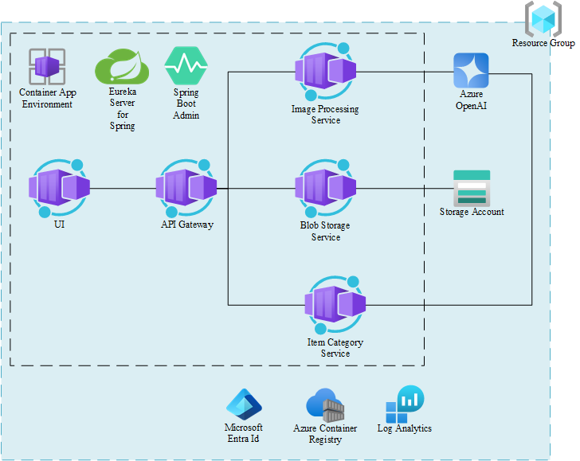

# Java AI - AI Shop

This is a simple AI Shop application that demonstrates how to use Azure OpenAI with Java to create a sample second hand shop. It uses the multi-modal capabilities of the OpenAI API to generate a description of the product based on an image. Instead of filling out a form, the users can simply upload an image of the product they want to sell and the AI will generate all the necessary information and fill the form for them.

The functional architecture of the application is as follows:
- `src/ai-shop-ui`: The user interface of the application. It is a simple React application that allows the user to upload an image and see the generated information in a form.
- `src/api-gateway`: The API Gateway of the application. It is a Spring Boot application that orchestrates the calls to the other services. It uses Spring Cloud Eureka Server for service discovery.
- `src/eureka-server`: The Eureka Server of the application. It is simple Eureka Server that is only required for local development.
- `src/ai-image-processing-service`: The AI Image Processing Service of the application. It is a Spring Boot application that uses `Spring AI` to generate the product information based on the image.
- `src/blob-storage-service`: The Blob Storage Service of the application. It is a Spring Boot application that uses `Spring Cloud Azure` to store the images in Azure Blob Storage. It also provide the generation of the image URL with a SAS token for the `ai-image-processing-service`.
- `src/item-category-service`: The Item Category Service of the application. It is a Spring Boot application that provides the categories of the items that can be sold in the shop. It uses `Spring Data JPA` to store the categories in a `H2` database. It is infused with AI and uses `LangChain4j` to generate the categories based on the product description.
- `src/java-ai-common`: A common module that is used by all the services. It contains the common DTOs.


## Features

This AI Shop application demonstrates several key features:

- **Multi-modal AI Integration**: Uses Azure OpenAI's vision capabilities to analyze product images and generate comprehensive product information automatically
- **Microservices Architecture**: Built with Spring Boot microservices including API Gateway, Eureka service discovery, and specialized services for different functions
- **Cloud-Native Deployment**: Fully containerized application deployable to Azure Container Apps with Azure Developer CLI (azd)
- **AI-Powered Categorization**: Intelligent product categorization using LangChain4j for enhanced product organization
- **Secure Blob Storage**: Azure Blob Storage integration with SAS token generation for secure image handling
- **Modern React UI**: Clean, responsive user interface for easy product upload and management
- **Enterprise Security**: Entra ID authentication and role-based access control for production readiness

## Getting Started

### Quick Start with Azure

The fastest way to get started is to deploy directly to Azure:

1. **Fork this repository** to your GitHub account
2. **Open in GitHub Codespace** (recommended) or clone locally
3. **Login to Azure** and run deployment:
   ```bash
   azd auth login
   azd up
   ```
4. **Access your application** at the provided endpoint after deployment completes

### Local Development

For local development and testing:

1. **Prerequisites**: Ensure you have Java 17+, Azure CLI, azd, and Docker installed
2. **Build the common module**: Follow instructions in [src/java-ai-common/common/README.md](src/java-ai-common/common/README.md)
3. **Start services in order**: Follow the detailed steps in the "Run locally" section below
4. **Access the application** at http://localhost:3000

## Guidance

### Architecture Decisions

This application follows several architectural patterns:

- **Microservices Pattern**: Each service has a single responsibility and can be deployed independently
- **API Gateway Pattern**: Centralized entry point for all client requests with service orchestration
- **Service Discovery**: Uses Eureka for dynamic service registration and discovery in local development
- **Event-Driven Architecture**: Services communicate through well-defined APIs and events
- **Cloud-First Design**: Built specifically for Azure Container Apps with proper scaling and monitoring

### Best Practices Implemented

- **Security**: Entra ID authentication, managed identities, and secure secret management
- **Monitoring**: Azure Log Analytics integration for comprehensive observability  
- **Scalability**: Container Apps auto-scaling based on demand
- **Reliability**: Health checks, graceful degradation, and proper error handling
- **Performance**: Optimized container images and efficient resource utilization

### Customization Guidelines

To adapt this application for your use case:

1. **Model Configuration**: Update AI model deployments in `infra/bicep/deploy.bicep`
2. **Service Logic**: Modify business logic in individual service modules
3. **UI Customization**: Update React components in `src/ai-shop-ui`
4. **Data Models**: Extend DTOs in `src/java-ai-common` for additional fields
5. **Infrastructure**: Adjust Azure resources in bicep templates as needed

## Resources

### Documentation

- [Azure Developer CLI Documentation](https://learn.microsoft.com/en-us/azure/developer/azure-developer-cli/)
- [Azure Container Apps Documentation](https://learn.microsoft.com/en-us/azure/container-apps/)
- [Azure OpenAI Service Documentation](https://learn.microsoft.com/en-us/azure/ai-services/openai/)
- [Spring Boot Documentation](https://spring.io/projects/spring-boot)
- [Spring AI Documentation](https://spring.io/projects/spring-ai)
- [LangChain4j Documentation](https://docs.langchain4j.dev/)

### Learning Resources

- [Azure AI Services Learning Path](https://learn.microsoft.com/en-us/training/paths/get-started-azure-ai/)
- [Java on Azure Learning Path](https://learn.microsoft.com/en-us/training/paths/java-on-azure/)
- [Microservices with Spring Boot](https://spring.io/microservices)
- [React.js Tutorial](https://reactjs.org/tutorial/tutorial.html)

### Sample Code and Templates

- [Azure-Samples GitHub Organization](https://github.com/Azure-Samples)
- [Azure Developer CLI Templates](https://azure.github.io/awesome-azd/)
- [Spring Boot Sample Applications](https://github.com/spring-projects/spring-boot/tree/main/spring-boot-samples)

### Community and Support

- [Azure Developer Community](https://techcommunity.microsoft.com/t5/azure-developer-community/ct-p/AzureDevCommunity)
- [Stack Overflow - Azure](https://stackoverflow.com/questions/tagged/azure)
- [GitHub Issues](https://github.com/Azure-Samples/java-ai/issues) for project-specific questions
- [Microsoft Q&A for Azure](https://learn.microsoft.com/en-us/answers/products/azure)

## Prerequisites

Easiest way to start is to Fork and [open the repository in a GitHub Codespace](https://github.com/codespaces/new/Azure-Samples/java-ai) as it contains all the prerequisites.

If you develop locally, you need to have the following installed:
- [Java 17+](https://learn.microsoft.com/java/openjdk/download)
- [Azure CLI](https://docs.microsoft.com/en-us/cli/azure/install-azure-cli)
- [Azure Developer CLI (azd)](https://learn.microsoft.com/en-us/azure/developer/azure-developer-cli/)
- [Docker](https://docs.docker.com/get-docker/) or [Podman](https://podman.io/getting-started/installation)

## Run locally

To run the AI Shop locally, you need first to build the common module and then start the services. Follow the instructions below in the order they are presented:

1. [Build the common module](src/java-ai-common/common/README.md)
2. [Start the Eureka Server](src/eureka-server/README.md)
3. [Start the Blob Storage Service](src/blob-storage-service/README.md)
4. [Start the AI Image Processing Service](src/ai-image-processing-service/README.md)
5. [Start the Item Category Service](src/item-category-service/README.md)
6. [Start the API Gateway](src/api-gateway/README.md)
7. [Start the AI Shop UI](src/ai-shop-ui/README.md)

## Deploy to Azure

The following resources will be created as represented in the diagram below:
- Resource Group
- Azure Container Registry
- [Azure Container Apps Environment](https://learn.microsoft.com/azure/container-apps/)
    - [Eureka Server for Spring Component](https://learn.microsoft.com/en-us/azure/container-apps/java-eureka-server-usage)
    - [Admin for Spring Component](https://learn.microsoft.com/en-us/azure/container-apps/java-admin-for-spring-usage)
- Azure Blob Storage Account
- User-assigned Managed Identity to pull the images from the Azure Container Registry
- Azure OpenAI
- [Azure Container Apps with Java Runtime](https://learn.microsoft.com/azure/container-apps/java-metrics)
- Azure Logs Analytics Workspace for monitoring



### Quick start

To deploy the AI Shop to Azure, you need only to run the `azd up` command. The [Azure Developer CLI (azd)](https://learn.microsoft.com/en-us/azure/developer/azure-developer-cli/) will create all the necessary resources in Azure and deploy the services to Azure Container Apps. Please login first, then choose a name for the resource group, a subscription and region.

```bash
azd auth login
azd up
```

After up to 15 minutes all resources will be deployed. Please call the printed endpoint of the ai-shop-ui of the terminal in a browser. You should see the start page of **The AI Shop**:


Just upload a product picture to generate name, brand, model, price, description, categories via OpenAI.


## Trademarks

This project may contain trademarks or logos for projects, products, or services. Authorized use of Microsoft
trademarks or logos is subject to and must follow
[Microsoft's Trademark & Brand Guidelines](https://www.microsoft.com/en-us/legal/intellectualproperty/trademarks/usage/general).
Use of Microsoft trademarks or logos in modified versions of this project must not cause confusion or imply Microsoft sponsorship.
Any use of third-party trademarks or logos are subject to those third-party's policies.
